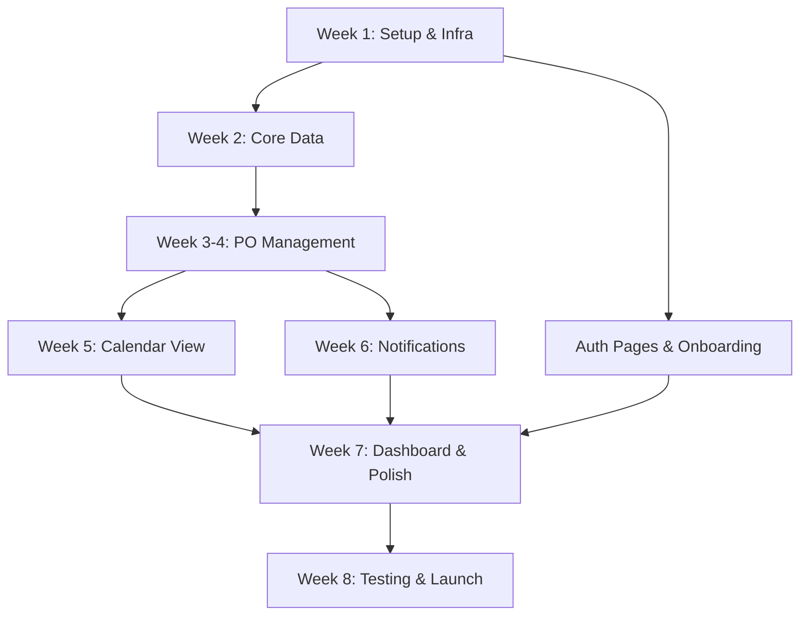

# PO Scheduler — Implementation Plan

> Aplikasi Web & PWA untuk Pencatatan Purchase Order Berbasis Agenda Kalender, ditargetkan untuk UMKM Indonesia.

## Ringkasan PRD

PO Scheduler adalah aplikasi **calendar-first** untuk mengelola Purchase Order. Target pengguna adalah UMKM Indonesia (omzet Rp 10jt–500jt/bulan, 10–200 pesanan/bulan). Fitur utama meliputi CRUD PO dengan multiple items, kalender interaktif, integrasi WhatsApp, email notifikasi, dashboard analytics, dan export PDF.

---

## User Review Required

> [!IMPORTANT]
> **Technology Stack Confirmation**: PRD menentukan Next.js 14+ (App Router) + TypeScript + Tailwind CSS + shadcn/ui + Supabase + tRPC + FullCalendar.js. Apakah Anda setuju dengan stack ini, atau ada preferensi lain?

> [!IMPORTANT]
> **Deployment Platform**: PRD menentukan Vercel (frontend + API) + Supabase Cloud (DB + Auth + Storage). Apakah sudah ada akun Vercel dan Supabase, atau perlu di-setup dari nol?

> [!WARNING]
> **WhatsApp Gateway**: PRD menyebutkan Fonnte/Wablas. Kedua provider ini unofficial (bukan Meta WA Business API) sehingga ada risiko pemblokiran nomor. Apakah sudah ada akun Fonnte/Wablas? Provider mana yang dipilih?

> [!IMPORTANT]
> **Email Provider**: PRD menyebutkan Resend untuk transactional email. Apakah sudah ada akun Resend dan domain yang sudah di-setup?

> [!IMPORTANT]
> **Scope Konfirmasi**: Apakah kita fokus pada **Phase 1 (MVP) saja** (8 minggu), atau ingin sekaligus merencanakan sampai Phase 2?

---

## Open Questions

1. **Nama Produk Final** — "PO Scheduler" adalah placeholder. Apakah sudah ada nama final untuk branding?
2. **Domain & Hosting** — Apakah sudah ada custom domain yang disiapkan?
3. **Supabase Project** — Apakah menggunakan Supabase Free tier atau Pro tier? (Pro tier diperlukan untuk point-in-time recovery)
4. **Background Jobs** — PRD menyebutkan Inngest atau Trigger.dev. Mana yang dipilih? Saya rekomendasikan **Inngest** karena integrasi Next.js-nya lebih mature.
5. **Analytics** — Apakah Posthog perlu di-setup sejak MVP, atau bisa ditunda ke Phase 2?
6. **Bahasa Aplikasi** — PRD menyatakan "Bahasa Indonesia native". Apakah seluruh UI dalam Bahasa Indonesia termasuk error messages, atau hybrid (label Indonesia, technical terms tetap English)?
7. **Sample Data** — Onboarding wizard menawarkan opsi "load dummy data". Apakah perlu disiapkan dataset contoh yang realistis (nama customer/produk Indonesia)?

---

## Proposed Changes

Proyek akan dibangun dari nol di direktori `c:\Users\Nindya Karya\Documents\Data Dari D\development\antigravity-apps\po-app`. Berikut adalah breakdown per komponen dan minggu.

---

### Phase 0: Project Initialization & Infrastructure (Week 1)

#### [NEW] Project Scaffolding

Setup Next.js 14+ project dengan App Router, TypeScript strict mode, Tailwind CSS, dan ESLint/Prettier.

```
po-app/
├── src/
│   ├── app/                    # Next.js App Router pages
│   │   ├── (auth)/             # Auth route group (login, register, forgot-password)
│   │   ├── (dashboard)/        # Protected route group
│   │   │   ├── dashboard/      # Home dashboard
│   │   │   ├── calendar/       # Calendar view (main landing)
│   │   │   ├── po/             # PO list, create, edit, detail
│   │   │   ├── customers/      # Customer management
│   │   │   ├── products/       # Product catalog
│   │   │   ├── reports/        # Analytics & reports
│   │   │   └── settings/       # Organization & user settings
│   │   ├── onboarding/         # Onboarding wizard (post-signup)
│   │   ├── api/                # API routes & tRPC handler
│   │   │   ├── trpc/           # tRPC HTTP handler
│   │   │   └── v1/             # REST API for 3rd-party (Phase 2)
│   │   ├── layout.tsx          # Root layout
│   │   └── page.tsx            # Landing/redirect
│   ├── components/
│   │   ├── ui/                 # shadcn/ui components
│   │   ├── layout/             # Shell, sidebar, header, bottom nav
│   │   ├── po/                 # PO-specific components
│   │   ├── calendar/           # Calendar wrapper & event components
│   │   ├── customers/          # Customer components
│   │   ├── products/           # Product components
│   │   ├── dashboard/          # Dashboard widgets
│   │   ├── notifications/      # Notification bell, toast
│   │   └── common/             # Shared (loading, empty state, error boundary)
│   ├── server/
│   │   ├── trpc/               # tRPC router, context, middleware
│   │   │   ├── router.ts       # Root app router
│   │   │   ├── context.ts      # tRPC context (auth, db)
│   │   │   ├── middleware.ts    # Auth, org, rate-limit middleware
│   │   │   └── routers/        # Feature routers
│   │   │       ├── auth.ts
│   │   │       ├── po.ts
│   │   │       ├── customer.ts
│   │   │       ├── product.ts
│   │   │       ├── notification.ts
│   │   │       └── report.ts
│   │   ├── db/                 # Database client & queries
│   │   │   ├── client.ts       # Supabase client (server-side)
│   │   │   └── queries/        # Typed query functions per table
│   │   ├── services/           # Business logic layer
│   │   │   ├── po.service.ts
│   │   │   ├── notification.service.ts
│   │   │   ├── whatsapp.service.ts
│   │   │   ├── email.service.ts
│   │   │   ├── pdf.service.ts
│   │   │   └── reminder.service.ts
│   │   └── lib/                # Server utilities
│   │       ├── auth.ts         # Auth helpers
│   │       ├── rls.ts          # RLS utility
│   │       └── validation.ts   # Zod schemas (shared)
│   ├── lib/                    # Client-side utilities
│   │   ├── supabase/
│   │   │   ├── client.ts       # Browser Supabase client
│   │   │   └── middleware.ts   # Next.js middleware for auth
│   │   ├── trpc/               # tRPC client setup
│   │   │   ├── client.ts
│   │   │   └── provider.tsx
│   │   ├── utils.ts            # General utilities
│   │   ├── constants.ts        # App constants
│   │   └── types.ts            # Shared TypeScript types
│   ├── hooks/                  # Custom React hooks
│   │   ├── use-po.ts
│   │   ├── use-calendar.ts
│   │   ├── use-notifications.ts
│   │   └── use-media-query.ts
│   └── styles/
│       └── globals.css         # Tailwind + custom styles
├── supabase/
│   ├── migrations/             # SQL migration files
│   ├── seed.sql                # Seed data for development
│   └── config.toml             # Supabase local config
├── public/
│   ├── manifest.json           # PWA manifest
│   ├── sw.js                   # Service worker
│   └── icons/                  # PWA icons
├── next.config.ts
├── tailwind.config.ts
├── tsconfig.json
├── package.json
└── .env.local.example
```

**File-file utama yang dibuat:**

- `package.json` — Dependencies: next, react, typescript, tailwindcss, @supabase/supabase-js, @supabase/ssr, @trpc/server, @trpc/client, @trpc/react-query, @tanstack/react-query, zod, @fullcalendar/react, @fullcalendar/daygrid, @fullcalendar/timegrid, @fullcalendar/interaction, recharts, @react-pdf/renderer, date-fns, lucide-react
- `next.config.ts` — PWA config, image domains, middleware
- `tailwind.config.ts` — Custom color tokens sesuai PRD (Primary #1F4E79, Secondary #2E75B6, Success #70AD47, Warning #FFC000, Danger #C00000)
- `.env.local.example` — Template environment variables

#### [NEW] Supabase Setup & Database Schema

Setup Supabase project dan buat migration files untuk semua tabel core.

##### Migration 001: Organizations & Users

```sql
-- supabase/migrations/001_organizations_users.sql
CREATE TABLE organizations (...);
CREATE TABLE users (...);
CREATE TABLE organization_members (...);
```

Sesuai schema di PRD Section 9.2.

##### Migration 002: Customers & Products

```sql
-- supabase/migrations/002_customers_products.sql
CREATE TABLE customers (...);
CREATE TABLE products (...);
-- Full-text search indexes
CREATE INDEX idx_customers_name_search ON customers USING gin(to_tsvector('indonesian', name));
CREATE INDEX idx_products_name_search ON products USING gin(to_tsvector('indonesian', name));
```

##### Migration 003: Purchase Orders

```sql
-- supabase/migrations/003_purchase_orders.sql
CREATE TABLE purchase_orders (...);
CREATE TABLE po_items (...);
CREATE TABLE po_status_history (...);
-- Performance indexes
CREATE INDEX idx_po_org_delivery ON purchase_orders(organization_id, delivery_date);
CREATE INDEX idx_po_org_status ON purchase_orders(organization_id, status);
CREATE INDEX idx_po_customer ON purchase_orders(customer_id);
```

##### Migration 004: Notifications

```sql
-- supabase/migrations/004_notifications.sql
CREATE TABLE notifications (...);
CREATE INDEX idx_notif_scheduled ON notifications(status, scheduled_at) WHERE status = 'pending';
```

##### Migration 005: RLS Policies

```sql
-- supabase/migrations/005_rls_policies.sql
-- Enable RLS on all business tables
-- Create policies for org_isolation
-- Separate policies per role (owner, admin, staff, viewer)
```

##### Migration 006: Functions & Triggers

```sql
-- supabase/migrations/006_functions_triggers.sql
-- auto_generate_po_number() function
-- update_updated_at() trigger
-- update_customer_stats() trigger (cached total_orders, total_revenue)
```

#### [NEW] Authentication Setup

- `src/lib/supabase/client.ts` — Browser-side Supabase client
- `src/lib/supabase/server.ts` — Server-side Supabase client (cookies-based)
- `src/lib/supabase/middleware.ts` — Next.js middleware untuk session refresh
- `src/middleware.ts` — Route protection, redirect unauthenticated users

#### [NEW] Design System & Layout Shell

- Install dan configure shadcn/ui components yang diperlukan: Button, Input, Select, Dialog, Sheet, DropdownMenu, Table, Card, Badge, Calendar (date picker), Tabs, Toast, Form, Popover, Command (combobox), Skeleton, Avatar
- `src/components/layout/app-shell.tsx` — Main layout dengan sidebar (desktop) + bottom nav (mobile)
- `src/components/layout/sidebar.tsx` — Navigation sidebar dengan menu items
- `src/components/layout/header.tsx` — Top bar dengan org name, notification bell, user menu
- `src/components/layout/bottom-nav.tsx` — Mobile bottom tab: Home, Calendar, +PO, Customers, More
- `src/styles/globals.css` — Custom CSS variables untuk color tokens PRD

---

### Phase 1: Core Data (Week 2)

#### [NEW] tRPC Setup

- `src/server/trpc/context.ts` — Context factory: extract auth session, org membership, inject Supabase client
- `src/server/trpc/middleware.ts` — `isAuthenticated`, `hasOrgAccess`, `hasRole` middleware
- `src/server/trpc/router.ts` — Root router menggabungkan semua feature routers
- `src/app/api/trpc/[trpc]/route.ts` — Next.js API handler untuk tRPC
- `src/lib/trpc/client.ts` — Client-side tRPC hooks setup dengan React Query

#### [NEW] Customer Module

- `src/server/trpc/routers/customer.ts` — CRUD procedures: list (paginated, searchable), get, create, update, delete (soft)
- `src/server/lib/validation.ts` — Zod schemas: `customerCreateSchema`, `customerUpdateSchema`
- `src/app/(dashboard)/customers/page.tsx` — Customer list page dengan search, filter, pagination
- `src/app/(dashboard)/customers/[id]/page.tsx` — Customer detail dengan PO history
- `src/components/customers/customer-form.tsx` — Create/edit form (dialog atau sheet)
- `src/components/customers/customer-table.tsx` — Data table dengan columns: nama, HP, email, total orders, total revenue
- `src/components/customers/customer-card.tsx` — Card view (mobile)

#### [NEW] Product Module

- `src/server/trpc/routers/product.ts` — CRUD procedures: list (paginated, filterable by category), get, create, update, toggle active
- Zod schemas: `productCreateSchema`, `productUpdateSchema`
- `src/app/(dashboard)/products/page.tsx` — Product catalog page dengan grid/list toggle
- `src/components/products/product-form.tsx` — Create/edit form dengan image upload
- `src/components/products/product-card.tsx` — Card dengan image, nama, harga, stock
- `src/components/products/product-table.tsx` — Table view

---

### Phase 2: PO Management (Week 3–4)

#### [NEW] PO Backend

- `src/server/trpc/routers/po.ts` — Procedures:
  - `po.list` — Paginated, filter by status/date range/customer, search by PO number
  - `po.get` — Get PO with items, customer info, status history
  - `po.create` — Create PO + items dalam transaction, auto-generate po_number
  - `po.update` — Update PO header + items (upsert/delete items)
  - `po.updateStatus` — Status transition validation (Draft→Confirmed→In Progress→Completed | →Cancelled)
  - `po.cancel` — Cancel dengan mandatory reason
  - `po.duplicate` — Copy PO ke draft baru
  - `po.calendar` — Get POs per date range untuk calendar view (optimized query)
  - `po.exportPdf` — Generate PDF invoice

- `src/server/services/po.service.ts` — Business logic:
  - PO number generation: `PO-YYYYMMDD-XXX` (sequential per org per day)
  - Status workflow validation
  - Total calculation: `subtotal = Σ(qty × unit_price)`, `total = subtotal - discount + tax`
  - Notification trigger on status change

- `src/server/lib/validation.ts` — Zod schemas:
  - `poCreateSchema` — Sesuai PRD Section 10.3
  - `poUpdateSchema`
  - `poStatusUpdateSchema`

#### [NEW] PO Frontend

- `src/app/(dashboard)/po/page.tsx` — PO list view dengan filters
- `src/app/(dashboard)/po/create/page.tsx` — Multi-step form (Customer → Items → Schedule → Review)
- `src/app/(dashboard)/po/[id]/page.tsx` — PO detail view
- `src/app/(dashboard)/po/[id]/edit/page.tsx` — Edit PO

- Components:
  - `src/components/po/po-create-form.tsx` — Multi-step wizard:
    - Step 1: Select/create customer (combobox with quick-add)
    - Step 2: Add items (product picker + qty + price + notes, repeatable)
    - Step 3: Set delivery date, order date, discount, tax, notes
    - Step 4: Review & submit
  - `src/components/po/po-table.tsx` — Data table dengan status badges, payment status
  - `src/components/po/po-card.tsx` — Card view untuk mobile
  - `src/components/po/po-detail.tsx` — Full detail display
  - `src/components/po/po-status-badge.tsx` — Color-coded status badge
  - `src/components/po/po-status-actions.tsx` — Quick status change buttons
  - `src/components/po/po-items-editor.tsx` — Dynamic item list editor
  - `src/components/po/po-timeline.tsx` — Status change history timeline

#### [NEW] PDF Export

- `src/server/services/pdf.service.ts` — Generate invoice PDF menggunakan `@react-pdf/renderer`
- Template invoice format dengan:
  - Header: logo org, nama, alamat, phone
  - PO info: nomor PO, tanggal order, tanggal kirim, status
  - Customer info: nama, alamat, phone
  - Items table: no, produk, qty, satuan, harga, subtotal
  - Summary: subtotal, diskon, pajak, total
  - Footer: notes, terms

---

### Phase 3: Calendar View (Week 5)

#### [NEW] Calendar Integration

- `src/app/(dashboard)/calendar/page.tsx` — Main calendar page (landing page setelah login)
- `src/components/calendar/calendar-view.tsx` — FullCalendar wrapper:
  - View modes: Month, Week, Day, List (agenda)
  - Event rendering: PO sebagai events di delivery_date
  - Color coding by status (configurable via org settings)
  - Click event → modal detail PO
  - Drag & drop → reschedule (update delivery_date)
  - Filter sidebar: by status, customer, product category
- `src/components/calendar/calendar-event.tsx` — Custom event render component (show PO number, customer name, total)
- `src/components/calendar/calendar-filter.tsx` — Filter panel (sidebar desktop, bottom sheet mobile)
- `src/components/calendar/calendar-toolbar.tsx` — Custom toolbar dengan view toggle dan navigation
- `src/hooks/use-calendar.ts` — Hook untuk fetch PO data berdasarkan visible date range

**Konfigurasi warna event default:**

| Status | Warna | Hex |
|--------|-------|-----|
| Draft | Gray | #9CA3AF |
| Confirmed | Blue (Primary) | #1F4E79 |
| In Progress | Yellow (Warning) | #FFC000 |
| Completed | Green (Success) | #70AD47 |
| Cancelled | Red (Danger) | #C00000 |

---

### Phase 4: Notifications (Week 6)

#### [NEW] WhatsApp Integration

- `src/server/services/whatsapp.service.ts` — WhatsApp gateway client:
  - `sendMessage(phone, message)` — Send single message
  - Template rendering dengan variable substitution
  - Retry logic (3x exponential backoff)
  - Provider abstraction (Fonnte/Wablas switchable)
- `src/server/services/notification.service.ts` — Notification orchestrator:
  - `notify(event, po, options)` — Route notifikasi ke channel yang sesuai
  - Events: `po_created`, `po_confirmed`, `reminder_h1`, `reminder_h0`, `po_completed`
  - Log semua notifikasi ke tabel `notifications`

#### [NEW] Email Integration

- `src/server/services/email.service.ts` — Resend client:
  - `sendVerificationEmail(user)`
  - `sendPasswordResetEmail(user, token)`
  - `sendPONotification(customer, po, template)`
  - `sendReminderEmail(user, pos)`
- Email templates (React Email components):
  - `src/server/emails/verification.tsx`
  - `src/server/emails/password-reset.tsx`
  - `src/server/emails/po-notification.tsx`
  - `src/server/emails/reminder-digest.tsx`

#### [NEW] Reminder Engine

- `src/server/services/reminder.service.ts` — Cron-based reminder:
  - Query PO dengan delivery_date = tomorrow AND status NOT IN (completed, cancelled)
  - Generate in-app notification + email + (optional) WhatsApp
  - Default schedule: H-1 jam 09:00, H-0 jam 07:00
- Background job setup menggunakan **Inngest**:
  - `src/server/jobs/reminder-h1.ts` — Cron `0 9 * * *` (H-1 reminder)
  - `src/server/jobs/reminder-h0.ts` — Cron `0 7 * * *` (H-0 reminder)
  - `src/server/jobs/send-wa.ts` — Event-triggered WA send worker
  - `src/server/jobs/send-email.ts` — Event-triggered email send worker

#### [NEW] In-App Notifications

- `src/server/trpc/routers/notification.ts` — Procedures:
  - `notification.list` — Get user notifications (paginated)
  - `notification.markRead` — Mark as read
  - `notification.markAllRead` — Mark all as read
- `src/components/notifications/notification-bell.tsx` — Header bell icon dengan unread count badge
- `src/components/notifications/notification-panel.tsx` — Dropdown/sheet panel dengan notification list
- `src/components/notifications/notification-item.tsx` — Individual notification item

---

### Phase 5: Dashboard & Reports (Week 7)

#### [NEW] Dashboard

- `src/app/(dashboard)/dashboard/page.tsx` — Home dashboard
- `src/server/trpc/routers/report.ts` — Procedures:
  - `report.todaySummary` — PO hari ini: count per status, total revenue
  - `report.revenueChart` — Revenue 30 hari terakhir (daily aggregate)
  - `report.topCustomers` — Top 5 customers by revenue (30 days)
  - `report.topProducts` — Top 5 products by quantity (30 days)
  - `report.pendingPayments` — Summary unpaid/DP POs

- Components:
  - `src/components/dashboard/today-card.tsx` — "Hari Ini" summary card
  - `src/components/dashboard/revenue-chart.tsx` — Line/bar chart (Recharts)
  - `src/components/dashboard/top-customers.tsx` — Leaderboard list
  - `src/components/dashboard/top-products.tsx` — Leaderboard list
  - `src/components/dashboard/pending-payments.tsx` — Payment summary card
  - `src/components/dashboard/mini-calendar.tsx` — Small calendar widget
  - `src/components/dashboard/quick-add-button.tsx` — FAB untuk create PO

#### [NEW] Reports Page

- `src/app/(dashboard)/reports/page.tsx` — Full reports page
- Advanced charts: revenue trend, PO volume trend, status distribution
- Export ke Excel (menggunakan `xlsx` library)

---

### Phase 6: Auth Pages & Onboarding (Week 1–2, paralel)

#### [NEW] Authentication Pages

- `src/app/(auth)/login/page.tsx` — Login form (email/password + Google OAuth button)
- `src/app/(auth)/register/page.tsx` — Register form (email, password, nama bisnis, nomor HP)
- `src/app/(auth)/forgot-password/page.tsx` — Forgot password form
- `src/app/(auth)/reset-password/page.tsx` — Reset password form
- `src/app/(auth)/verify-email/page.tsx` — Email verification handler

#### [NEW] Onboarding Wizard

- `src/app/onboarding/page.tsx` — 3-step onboarding wizard:
  - Step 1: Info bisnis (nama, alamat, logo, timezone)
  - Step 2: Tambah customer pertama (atau skip)
  - Step 3: Tambah produk pertama (atau skip)
- Option: "Muat data contoh" untuk eksplorasi
- Progress indicator di top

---

### Phase 7: Settings & Polish (Week 7)

#### [NEW] Settings Pages

- `src/app/(dashboard)/settings/page.tsx` — Settings layout dengan tabs
- `src/app/(dashboard)/settings/profile/page.tsx` — User profile (nama, email, avatar, password change)
- `src/app/(dashboard)/settings/organization/page.tsx` — Org settings (nama, logo, alamat, timezone, currency)
- `src/app/(dashboard)/settings/notifications/page.tsx` — Notification preferences (email on/off, WA on/off, reminder timing)
- `src/app/(dashboard)/settings/integrations/page.tsx` — WA gateway config (API key, phone number), Email config

#### [NEW] PWA Configuration

- `public/manifest.json` — PWA manifest (name, icons, theme_color, background_color, display: standalone)
- `public/sw.js` — Service worker untuk caching (offline-first basic)
- `next.config.ts` — PWA headers & configuration

#### [NEW] Mobile Responsiveness

- Review semua pages untuk mobile breakpoints
- Bottom sheet forms (bukan full-page modal) di mobile
- Touch targets minimum 44x44 pt
- Pull-to-refresh di list views
- FAB positioning

---

### Phase 8: Testing, Bug Fix & Launch (Week 8)

#### [NEW] Testing

- Unit tests (Vitest):
  - PO number generation logic
  - Status workflow validation
  - Total calculation (subtotal, discount, tax)
  - Zod schema validation
  - Date utility functions

- Integration tests (Vitest + Supabase local):
  - tRPC procedures: CRUD operations
  - RLS policy verification (org isolation)
  - Auth flow: register → verify → login
  - PO lifecycle: create → update status → complete

- E2E tests (Playwright):
  - Sign up → onboarding → create first PO → see in calendar
  - Create customer → create PO → change status workflow
  - Calendar interactions (view toggle, filter, click event)
  - PDF export flow
  - Mobile responsive flows

#### [NEW] Performance & Launch Checklist

- Lighthouse audit: Performance > 90, Accessibility > 95
- Database query optimization (EXPLAIN ANALYZE pada calendar query)
- Image optimization (next/image)
- Bundle size analysis
- Error boundary setup (Sentry integration)
- SEO meta tags
- Analytics setup (Posthog)
- Production environment variables
- Custom domain & SSL
- Monitoring & alerting setup (BetterStack)

---

## Dependency Graph



---

## Tech Stack Summary

| Layer | Technology |
|-------|-----------|
| **Framework** | Next.js 14+ (App Router) |
| **Language** | TypeScript (strict mode) |
| **Styling** | Tailwind CSS + shadcn/ui |
| **Database** | PostgreSQL 15+ (Supabase) |
| **Auth** | Supabase Auth (email/password + Google OAuth) |
| **API** | tRPC v11 (type-safe) |
| **Calendar** | FullCalendar.js v6 |
| **Charts** | Recharts |
| **PDF** | @react-pdf/renderer |
| **Email** | Resend + React Email |
| **WhatsApp** | Fonnte / Wablas API |
| **Background Jobs** | Inngest |
| **File Storage** | Supabase Storage |
| **Hosting** | Vercel + Supabase Cloud |
| **Monitoring** | Sentry + BetterStack |
| **Analytics** | Posthog |
| **Testing** | Vitest + Playwright |
| **CI/CD** | GitHub Actions + Vercel auto-deploy |

---

## Verification Plan

### Automated Tests
- `npm run test` — Vitest unit & integration tests (target coverage > 70%)
- `npm run test:e2e` — Playwright E2E tests untuk 6 critical flows
- `npm run lint` — ESLint + TypeScript strict check
- `npm run build` — Verify production build succeeds
- Lighthouse CI — Performance > 90, Accessibility > 95

### Manual Verification
- Mobile responsiveness testing pada device Android (Chrome) dan iOS (Safari)
- WhatsApp notification delivery testing dengan nomor real
- PDF export readability check
- Calendar drag-and-drop pada browser desktop
- Onboarding flow walkthrough dari signup ke first PO
- Multi-tenant isolation: login 2 akun berbeda, pastikan data terisolasi

### UAT
- Beta testing dengan 5 user real selama 2 minggu
- Structured feedback form per fitur utama
- Daily bug triage, fix critical sebelum public launch

---

## Estimated Timeline

| Minggu | Focus | Deliverables |
|--------|-------|-------------|
| **1** | Setup & Infra | Repo, CI/CD, Supabase, DB schema, auth, design system, layout shell |
| **2** | Core Data | tRPC setup, customer CRUD, product CRUD, auth pages, onboarding |
| **3–4** | PO Core | PO CRUD with items, status workflow, validations, PDF export |
| **5** | Calendar | FullCalendar integration, filters, drag-drop, event rendering |
| **6** | Notifications | WhatsApp integration, email setup, reminder cron, in-app notifications |
| **7** | Polish | Dashboard, basic reports, settings, PWA config, mobile responsive |
| **8** | Launch | Bug fixes, performance optimization, testing, soft launch |
