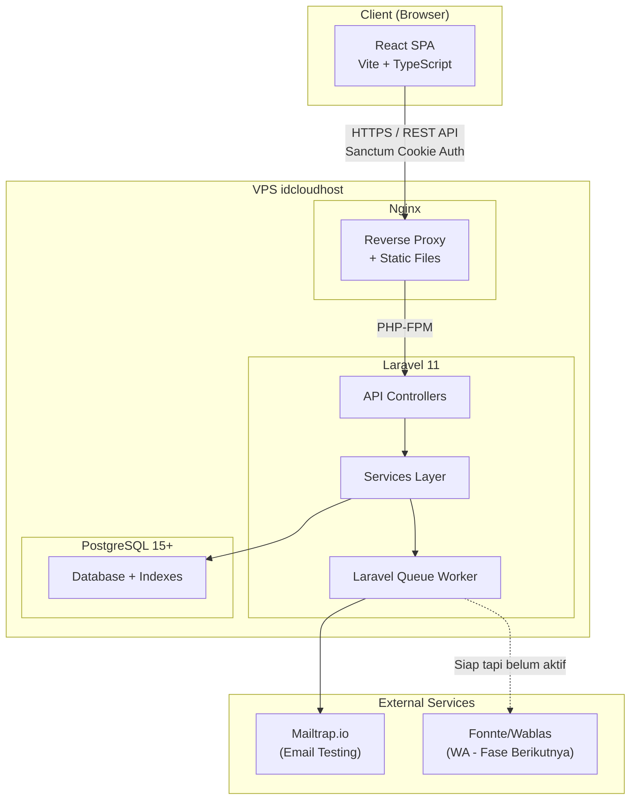
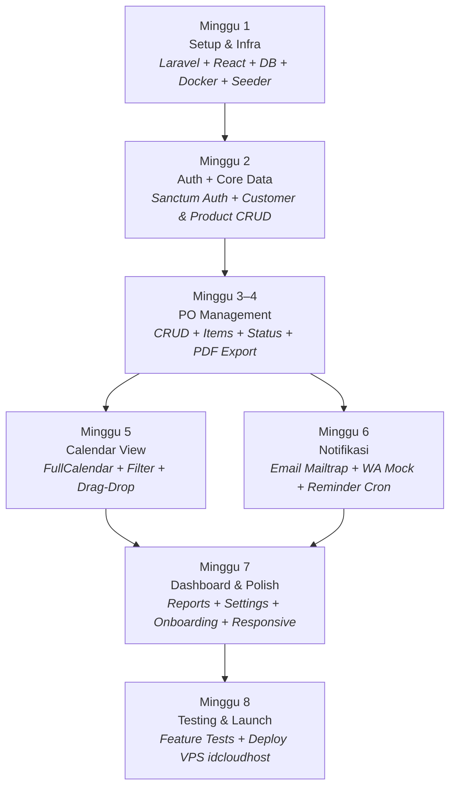

# PO Scheduler — Implementation Plan (Updated)

> Aplikasi Web untuk Pencatatan Purchase Order Berbasis Agenda Kalender, ditargetkan untuk UMKM Indonesia.

---

## Perubahan dari Plan Sebelumnya

| Aspek | Sebelumnya | Sekarang |
|-------|-----------|----------|
| **Backend** | Next.js API Routes + tRPC | **Laravel 11 (API)** |
| **Frontend** | Next.js App Router | **React 18 + Vite (SPA)** |
| **Database** | Supabase (managed PG) | **PostgreSQL 15+ (self-hosted)** |
| **Auth** | Supabase Auth | **Laravel Sanctum (SPA cookie-based)** |
| **Background Jobs** | Inngest | **Laravel Queue (database driver)** |
| **Email** | Resend | **Mailtrap.io (testing)** |
| **WhatsApp** | Fonnte/Wablas | **Disiapkan interface, belum diintegrasikan** |
| **Deployment** | Vercel + Supabase Cloud | **VPS idcloudhost (Nginx + PHP-FPM)** |
| **Scope** | Phase 1 + outline Phase 2 | **Phase 1 MVP saja (8 minggu)** |

---

## User Review Required

> [!IMPORTANT]
> **React Approach**: Saya merencanakan React sebagai **SPA terpisah** (Vite) yang berkomunikasi dengan Laravel via REST API + Sanctum cookie auth. Alternatif lain adalah **Inertia.js** (React embedded di Laravel). Apakah Anda prefer SPA terpisah atau Inertia.js?

> [!IMPORTANT]
> **VPS Spec**: Untuk MVP, minimal VPS **2 vCPU, 2GB RAM, 40GB SSD** sudah cukup. Apakah sudah ada VPS aktif di idcloudhost, atau perlu di-provision baru?

> [!IMPORTANT]
> **UI Component Library**: Saya merencanakan **shadcn/ui** (port React) untuk konsistensi desain premium. Atau prefer library lain seperti Ant Design / MUI?

> [!WARNING]
> **WhatsApp Integration**: Karena belum ada akun provider, modul WA akan disiapkan sebagai **service interface + mock/log driver**. Ketika akun Fonnte/Wablas siap, tinggal implementasi driver-nya tanpa ubah arsitektur.

---

## Open Questions

1. **SPA vs Inertia.js** — SPA terpisah lebih fleksibel untuk mobile app nanti, tapi Inertia.js lebih cepat di-develop. Mana yang dipilih?
2. **VPS sudah ada?** — Jika belum, apakah mau saya sertakan panduan provisioning di plan?
3. **PHP Version** — Apakah sudah ada PHP 8.2+ di environment lokal Anda?
4. **Logo & Branding** — Apakah sudah ada logo, atau perlu digenerate placeholder?

---

## Proposed Changes

### Arsitektur Keseluruhan

```
po-app/
├── backend/                    # Laravel 11 API
│   ├── app/
│   ├── database/
│   ├── routes/
│   ├── ...
│   └── .env
├── frontend/                   # React + Vite SPA
│   ├── src/
│   ├── public/
│   ├── ...
│   └── .env
└── docker-compose.yml          # Local dev (PostgreSQL + Mailpit)
```



---

### Minggu 1: Setup & Infrastruktur

#### Backend — Laravel Project Init

##### [NEW] `backend/` — Laravel 11 API Project

Inisialisasi project Laravel dengan konfigurasi API-only.

**Packages yang di-install:**
- `laravel/sanctum` — SPA cookie authentication
- `barryvdh/laravel-dompdf` — PDF export
- `maatwebsite/excel` — Excel export (untuk reports)
- `spatie/laravel-query-builder` — API filtering, sorting, pagination
- `spatie/laravel-data` — DTO/data objects
- `spatie/laravel-permission` — Role & permission management (Phase 2, tapi setup sekarang)

**Struktur backend:**

```
backend/
├── app/
│   ├── Http/
│   │   ├── Controllers/
│   │   │   ├── Auth/
│   │   │   │   ├── LoginController.php
│   │   │   │   ├── RegisterController.php
│   │   │   │   ├── ForgotPasswordController.php
│   │   │   │   └── ResetPasswordController.php
│   │   │   ├── CustomerController.php
│   │   │   ├── ProductController.php
│   │   │   ├── PurchaseOrderController.php
│   │   │   ├── CalendarController.php
│   │   │   ├── DashboardController.php
│   │   │   ├── ReportController.php
│   │   │   ├── NotificationController.php
│   │   │   └── SettingController.php
│   │   ├── Middleware/
│   │   │   └── EnsureOrganizationAccess.php
│   │   ├── Requests/
│   │   │   ├── Auth/
│   │   │   │   ├── LoginRequest.php
│   │   │   │   └── RegisterRequest.php
│   │   │   ├── Customer/
│   │   │   │   ├── StoreCustomerRequest.php
│   │   │   │   └── UpdateCustomerRequest.php
│   │   │   ├── Product/
│   │   │   │   ├── StoreProductRequest.php
│   │   │   │   └── UpdateProductRequest.php
│   │   │   └── PurchaseOrder/
│   │   │       ├── StorePurchaseOrderRequest.php
│   │   │       ├── UpdatePurchaseOrderRequest.php
│   │   │       ├── UpdateStatusRequest.php
│   │   │       └── CancelPurchaseOrderRequest.php
│   │   └── Resources/
│   │       ├── CustomerResource.php
│   │       ├── ProductResource.php
│   │       ├── PurchaseOrderResource.php
│   │       ├── PurchaseOrderDetailResource.php
│   │       ├── CalendarEventResource.php
│   │       ├── NotificationResource.php
│   │       └── DashboardResource.php
│   ├── Models/
│   │   ├── User.php
│   │   ├── Organization.php
│   │   ├── OrganizationMember.php
│   │   ├── Customer.php
│   │   ├── Product.php
│   │   ├── PurchaseOrder.php
│   │   ├── PurchaseOrderItem.php
│   │   ├── PurchaseOrderStatusHistory.php
│   │   └── Notification.php
│   ├── Services/
│   │   ├── PurchaseOrderService.php
│   │   ├── PurchaseOrderNumberGenerator.php
│   │   ├── NotificationService.php
│   │   ├── WhatsAppService.php        # Interface + mock driver
│   │   ├── PdfExportService.php
│   │   └── ReminderService.php
│   ├── Jobs/
│   │   ├── SendWhatsAppNotification.php
│   │   ├── SendEmailNotification.php
│   │   ├── ProcessReminders.php
│   │   └── GeneratePdfInvoice.php
│   ├── Mail/
│   │   ├── VerifyEmail.php
│   │   ├── ResetPassword.php
│   │   ├── PurchaseOrderConfirmation.php
│   │   ├── DeliveryReminder.php
│   │   └── DailyDigest.php
│   ├── Enums/
│   │   ├── PurchaseOrderStatus.php     # draft, confirmed, in_progress, completed, cancelled
│   │   ├── PaymentStatus.php           # unpaid, dp, paid
│   │   ├── NotificationChannel.php     # in_app, email, whatsapp
│   │   ├── NotificationStatus.php      # pending, sent, failed, delivered
│   │   └── MemberRole.php             # owner, admin, staff, viewer
│   ├── Observers/
│   │   ├── PurchaseOrderObserver.php   # Auto-log status changes, trigger notifications
│   │   └── CustomerObserver.php        # Update cached stats
│   ├── Policies/
│   │   ├── PurchaseOrderPolicy.php
│   │   ├── CustomerPolicy.php
│   │   └── ProductPolicy.php
│   └── Traits/
│       └── BelongsToOrganization.php   # Scope queries ke org user aktif
├── database/
│   ├── migrations/
│   │   ├── 0001_create_organizations_table.php
│   │   ├── 0002_add_organization_to_users_table.php
│   │   ├── 0003_create_organization_members_table.php
│   │   ├── 0004_create_customers_table.php
│   │   ├── 0005_create_products_table.php
│   │   ├── 0006_create_purchase_orders_table.php
│   │   ├── 0007_create_purchase_order_items_table.php
│   │   ├── 0008_create_po_status_history_table.php
│   │   ├── 0009_create_notifications_table.php
│   │   └── 0010_create_jobs_table.php
│   ├── seeders/
│   │   ├── DatabaseSeeder.php
│   │   ├── OrganizationSeeder.php
│   │   ├── UserSeeder.php
│   │   ├── CustomerSeeder.php
│   │   ├── ProductSeeder.php
│   │   ├── PurchaseOrderSeeder.php
│   │   └── NotificationSeeder.php
│   └── factories/
│       ├── OrganizationFactory.php
│       ├── CustomerFactory.php
│       ├── ProductFactory.php
│       ├── PurchaseOrderFactory.php
│       └── PurchaseOrderItemFactory.php
├── routes/
│   ├── api.php                         # Semua API routes
│   └── console.php                     # Scheduled commands (reminders)
├── config/
│   ├── cors.php                        # CORS untuk React SPA
│   ├── sanctum.php                     # Sanctum SPA config
│   └── whatsapp.php                    # WA gateway config
├── tests/
│   ├── Feature/
│   │   ├── Auth/
│   │   ├── PurchaseOrder/
│   │   ├── Customer/
│   │   └── Product/
│   └── Unit/
│       ├── Services/
│       └── Models/
└── .env.example
```

##### [NEW] `backend/routes/api.php` — API Routes

```php
// Authentication
Route::prefix('auth')->group(function () {
    Route::post('/register', [RegisterController::class, 'register']);
    Route::post('/login', [LoginController::class, 'login']);
    Route::post('/forgot-password', [ForgotPasswordController::class, 'sendResetLink']);
    Route::post('/reset-password', [ResetPasswordController::class, 'reset']);

    Route::middleware('auth:sanctum')->group(function () {
        Route::post('/logout', [LoginController::class, 'logout']);
        Route::get('/me', [LoginController::class, 'me']);
    });
});

// Protected routes
Route::middleware(['auth:sanctum', 'org.access'])->group(function () {
    // Customers
    Route::apiResource('customers', CustomerController::class);

    // Products
    Route::apiResource('products', ProductController::class);

    // Purchase Orders
    Route::apiResource('purchase-orders', PurchaseOrderController::class);
    Route::patch('purchase-orders/{po}/status', [PurchaseOrderController::class, 'updateStatus']);
    Route::post('purchase-orders/{po}/cancel', [PurchaseOrderController::class, 'cancel']);
    Route::post('purchase-orders/{po}/duplicate', [PurchaseOrderController::class, 'duplicate']);
    Route::get('purchase-orders/{po}/export-pdf', [PurchaseOrderController::class, 'exportPdf']);

    // Calendar
    Route::get('calendar/events', [CalendarController::class, 'events']);
    Route::patch('calendar/events/{po}/reschedule', [CalendarController::class, 'reschedule']);

    // Dashboard
    Route::get('dashboard/today-summary', [DashboardController::class, 'todaySummary']);
    Route::get('dashboard/revenue-chart', [DashboardController::class, 'revenueChart']);
    Route::get('dashboard/top-customers', [DashboardController::class, 'topCustomers']);
    Route::get('dashboard/top-products', [DashboardController::class, 'topProducts']);
    Route::get('dashboard/pending-payments', [DashboardController::class, 'pendingPayments']);

    // Reports
    Route::get('reports/revenue', [ReportController::class, 'revenue']);
    Route::get('reports/export-excel', [ReportController::class, 'exportExcel']);

    // Notifications
    Route::get('notifications', [NotificationController::class, 'index']);
    Route::patch('notifications/{id}/read', [NotificationController::class, 'markRead']);
    Route::patch('notifications/read-all', [NotificationController::class, 'markAllRead']);

    // Settings
    Route::get('settings/organization', [SettingController::class, 'getOrganization']);
    Route::put('settings/organization', [SettingController::class, 'updateOrganization']);
    Route::put('settings/profile', [SettingController::class, 'updateProfile']);
    Route::put('settings/notifications', [SettingController::class, 'updateNotificationPrefs']);
});
```

---

##### [NEW] Database Migrations — Detail Schema

**Migration: `create_organizations_table`**
```
organizations:
  id              UUID PK default gen_random_uuid()
  name            VARCHAR(255) NOT NULL
  slug            VARCHAR(100) UNIQUE
  phone           VARCHAR(20)
  address         TEXT
  logo_url        TEXT
  settings        JSONB DEFAULT '{}'   -- timezone, currency, po_prefix, wa_config, notification_prefs
  created_at      TIMESTAMP
  updated_at      TIMESTAMP
```

**Migration: `add_organization_to_users_table`**
```
users (modify existing):
  + full_name       VARCHAR(255)
  + phone            VARCHAR(20)
  + avatar_url       TEXT
  + current_org_id   UUID FK organizations.id (active org)
  + last_login_at    TIMESTAMP
```

**Migration: `create_organization_members_table`**
```
organization_members:
  id                UUID PK
  organization_id   UUID FK NOT NULL
  user_id           UUID FK NOT NULL
  role              VARCHAR(50) DEFAULT 'owner'  -- owner, admin, staff, viewer
  invited_by        UUID FK NULLABLE
  joined_at         TIMESTAMP DEFAULT NOW()
  UNIQUE(organization_id, user_id)
```

**Migration: `create_customers_table`**
```
customers:
  id                UUID PK
  organization_id   UUID FK NOT NULL INDEX
  name              VARCHAR(255) NOT NULL
  phone             VARCHAR(20)
  email             VARCHAR(255)
  address           TEXT
  notes             TEXT
  tags              TEXT[] DEFAULT '{}'
  total_orders      INTEGER DEFAULT 0
  total_revenue     DECIMAL(15,2) DEFAULT 0
  created_at        TIMESTAMP
  updated_at        TIMESTAMP
  deleted_at        TIMESTAMP (soft delete)
  INDEX(organization_id, name)
```

**Migration: `create_products_table`**
```
products:
  id                UUID PK
  organization_id   UUID FK NOT NULL INDEX
  name              VARCHAR(255) NOT NULL
  sku               VARCHAR(100)
  description       TEXT
  unit              VARCHAR(50) DEFAULT 'pcs'
  price             DECIMAL(15,2) NOT NULL DEFAULT 0
  cost              DECIMAL(15,2)
  category          VARCHAR(100)
  image_url         TEXT
  stock_qty         INTEGER DEFAULT 0
  is_active         BOOLEAN DEFAULT true
  created_at        TIMESTAMP
  updated_at        TIMESTAMP
  deleted_at        TIMESTAMP (soft delete)
  UNIQUE(organization_id, sku) WHERE sku IS NOT NULL
```

**Migration: `create_purchase_orders_table`**
```
purchase_orders:
  id                UUID PK
  organization_id   UUID FK NOT NULL
  po_number         VARCHAR(50) NOT NULL
  customer_id       UUID FK NOT NULL
  order_date        DATE NOT NULL DEFAULT CURRENT_DATE
  delivery_date     DATE NOT NULL
  status            VARCHAR(50) DEFAULT 'draft'
  payment_status    VARCHAR(50) DEFAULT 'unpaid'
  dp_amount         DECIMAL(15,2) DEFAULT 0
  paid_amount       DECIMAL(15,2) DEFAULT 0
  subtotal          DECIMAL(15,2) DEFAULT 0
  discount          DECIMAL(15,2) DEFAULT 0
  tax               DECIMAL(15,2) DEFAULT 0
  total             DECIMAL(15,2) DEFAULT 0
  notes             TEXT
  created_by        UUID FK users.id
  created_at        TIMESTAMP
  updated_at        TIMESTAMP
  deleted_at        TIMESTAMP (soft delete)
  UNIQUE(organization_id, po_number)
  INDEX(organization_id, delivery_date)
  INDEX(organization_id, status)
  INDEX(customer_id)
```

**Migration: `create_purchase_order_items_table`**
```
po_items:
  id              UUID PK
  po_id           UUID FK ON DELETE CASCADE
  product_id      UUID FK
  product_name    VARCHAR(255) NOT NULL     -- snapshot
  quantity        DECIMAL(10,2) NOT NULL
  unit_price      DECIMAL(15,2) NOT NULL
  subtotal        DECIMAL(15,2) NOT NULL    -- qty × unit_price
  notes           TEXT
  sort_order      INTEGER DEFAULT 0
```

**Migration: `create_po_status_history_table`**
```
po_status_history:
  id              UUID PK
  po_id           UUID FK ON DELETE CASCADE
  from_status     VARCHAR(50)
  to_status       VARCHAR(50) NOT NULL
  changed_by      UUID FK users.id
  reason          TEXT
  changed_at      TIMESTAMP DEFAULT NOW()
  INDEX(po_id, changed_at)
```

**Migration: `create_notifications_table`**
```
notifications:
  id                UUID PK
  organization_id   UUID FK
  user_id           UUID FK NULLABLE         -- untuk in-app notifications ke user tertentu
  po_id             UUID FK NULLABLE
  channel           VARCHAR(50) NOT NULL      -- in_app, email, whatsapp
  recipient         VARCHAR(255)              -- email/phone target
  title             VARCHAR(255)
  message           TEXT
  template_key      VARCHAR(100)
  payload           JSONB DEFAULT '{}'
  status            VARCHAR(50) DEFAULT 'pending'
  error_message     TEXT
  scheduled_at      TIMESTAMP
  sent_at           TIMESTAMP
  read_at           TIMESTAMP
  created_at        TIMESTAMP
  INDEX(user_id, read_at) WHERE channel = 'in_app'
  INDEX(status, scheduled_at) WHERE status = 'pending'
```

---

##### [NEW] Database Seeders — Data Realistis Indonesia

Seeder akan membuat data demo lengkap agar aplikasi bisa langsung dieksplorasi setelah install.

**`DatabaseSeeder.php`** — Menjalankan semua seeder dalam urutan yang benar.

**`OrganizationSeeder.php`** — 1 organisasi demo:
```
Nama: "Dapur Kue Sari"
Slug: "dapur-kue-sari"
Phone: "081234567890"
Address: "Jl. Cihampelas No. 42, Bandung, Jawa Barat 40131"
Settings: { timezone: "Asia/Jakarta", currency: "IDR", po_prefix: "PO" }
```

**`UserSeeder.php`** — 2 user demo:
```
1. Admin/Owner:
   Email: admin@demo.com
   Password: password123
   Nama: "Sari Wulandari"
   Phone: "081234567890"
   Role: owner

2. Staff:
   Email: staff@demo.com
   Password: password123
   Nama: "Rina Permatasari"
   Phone: "081298765432"
   Role: staff
```

**`CustomerSeeder.php`** — 10 customer realistis:
```
1.  "Ibu Dewi Susanti"       — 081311112222 — Jl. Dago No. 15, Bandung
2.  "Pak Ahmad Hidayat"      — 081322223333 — Jl. Braga No. 88, Bandung
3.  "Bu Ratna Sari"          — 081333334444 — Jl. Merdeka No. 10, Bandung
4.  "PT Berkah Catering"     — 081344445555 — Jl. Asia Afrika No. 50, Bandung
5.  "Toko Roti Makmur"       — 081355556666 — Jl. Setiabudi No. 23, Bandung
6.  "Ibu Lina Marlina"       — 081366667777 — Jl. Pasteur No. 12, Bandung
7.  "Pak Budi Santoso"       — 081377778888 — Jl. Pajajaran No. 77, Bandung
8.  "CV Pesta Rasa"          — 081388889999 — Jl. Gatot Subroto No. 30, Bandung
9.  "Bu Ningsih Rahayu"      — 081399990000 — Jl. Diponegoro No. 5, Bandung
10. "Kantor Kecamatan Coblong" — 081300001111 — Jl. Siliwangi No. 1, Bandung
```

**`ProductSeeder.php`** — 12 produk (toko kue):
```
1.  "Kue Lapis Legit"         — Rp 185.000 — pcs — Kategori: Kue Basah
2.  "Brownies Panggang"       — Rp 65.000  — loyang — Kategori: Kue Kering
3.  "Nastar Keju (500gr)"     — Rp 95.000  — toples — Kategori: Kue Kering
4.  "Bolu Gulung Vanilla"     — Rp 55.000  — pcs — Kategori: Kue Basah
5.  "Kue Tart Ulang Tahun"    — Rp 250.000 — pcs — Kategori: Tart
6.  "Croissant Butter (6pcs)" — Rp 78.000  — box — Kategori: Roti
7.  "Risol Mayo (20pcs)"      — Rp 60.000  — box — Kategori: Snack Box
8.  "Lemper Ayam (20pcs)"     — Rp 50.000  — box — Kategori: Snack Box
9.  "Snack Box Paket A"       — Rp 25.000  — box — Kategori: Snack Box
10. "Snack Box Paket B"       — Rp 35.000  — box — Kategori: Snack Box
11. "Red Velvet Cake"         — Rp 275.000 — pcs — Kategori: Tart
12. "Puding Karamel (cup)"    — Rp 12.000  — pcs — Kategori: Dessert
```

**`PurchaseOrderSeeder.php`** — 25 PO dengan variasi:
- Status tersebar: 5 Draft, 5 Confirmed, 8 In Progress, 5 Completed, 2 Cancelled
- Tanggal delivery tersebar di bulan ini dan minggu depan
- Payment status variasi: 10 Unpaid, 8 DP, 7 Paid
- Masing-masing PO punya 1–4 items
- Status history terisi untuk PO yang sudah beyond Draft
- Beberapa PO memiliki notes realistis (contoh: "Tolong tulisan Happy Birthday Mama", "Kirim sebelum jam 10 pagi")

**`NotificationSeeder.php`** — 10 sample notifications:
- Campuran in-app, email (mock)
- Beberapa read, beberapa unread
- Contoh: "PO-20260520-001 dikonfirmasi", "Pengiriman besok: 3 pesanan"

---

##### [NEW] `docker-compose.yml` — Local Development

```yaml
services:
  postgres:
    image: postgres:15-alpine
    ports: ["5432:5432"]
    environment:
      POSTGRES_DB: po_scheduler
      POSTGRES_USER: po_admin
      POSTGRES_PASSWORD: secret
    volumes:
      - pgdata:/var/lib/postgresql/data

  mailpit:     # Email testing UI (pengganti Mailtrap untuk local)
    image: axllent/mailpit
    ports:
      - "1025:1025"   # SMTP
      - "8025:8025"   # Web UI

volumes:
  pgdata:
```

---

#### Frontend — React + Vite Project Init

##### [NEW] `frontend/` — React SPA

**Packages yang di-install:**
- `react`, `react-dom`, `react-router-dom` — Core & routing
- `typescript` — Type safety
- `@tanstack/react-query` — Server state management
- `axios` — HTTP client
- `@fullcalendar/react`, `@fullcalendar/daygrid`, `@fullcalendar/timegrid`, `@fullcalendar/list`, `@fullcalendar/interaction` — Calendar
- `recharts` — Charts untuk dashboard & reports
- `react-hook-form` + `@hookform/resolvers` + `zod` — Form handling & validation
- `tailwindcss`, `@tailwindcss/vite` — Styling
- `lucide-react` — Icons
- `date-fns` — Date utilities
- `sonner` — Toast notifications
- `clsx`, `tailwind-merge` — Utility class merging

**Catatan**: Untuk UI components, saya akan membuat custom components dengan Tailwind CSS yang mengikuti design tokens PRD (Primary #1F4E79, Secondary #2E75B6, dst). Ini memberikan kontrol penuh atas desain tanpa dependency ke component library besar.

**Struktur frontend:**

```
frontend/
├── src/
│   ├── api/                        # API client & endpoint functions
│   │   ├── client.ts               # Axios instance (base URL, interceptors, CSRF)
│   │   ├── auth.ts                 # login, register, logout, me, forgotPassword
│   │   ├── customers.ts            # CRUD customer endpoints
│   │   ├── products.ts             # CRUD product endpoints
│   │   ├── purchase-orders.ts      # CRUD PO + status + cancel + duplicate + exportPdf
│   │   ├── calendar.ts             # events, reschedule
│   │   ├── dashboard.ts            # todaySummary, revenueChart, topCustomers, etc.
│   │   ├── notifications.ts        # list, markRead, markAllRead
│   │   └── settings.ts             # getOrg, updateOrg, updateProfile, updateNotifPrefs
│   ├── components/
│   │   ├── ui/                     # Base UI components (Button, Input, Select, Dialog, etc.)
│   │   │   ├── button.tsx
│   │   │   ├── input.tsx
│   │   │   ├── select.tsx
│   │   │   ├── dialog.tsx
│   │   │   ├── sheet.tsx
│   │   │   ├── dropdown-menu.tsx
│   │   │   ├── badge.tsx
│   │   │   ├── card.tsx
│   │   │   ├── table.tsx
│   │   │   ├── tabs.tsx
│   │   │   ├── skeleton.tsx
│   │   │   ├── toast.tsx
│   │   │   ├── date-picker.tsx
│   │   │   ├── combobox.tsx
│   │   │   ├── empty-state.tsx
│   │   │   └── loading-spinner.tsx
│   │   ├── layout/
│   │   │   ├── app-shell.tsx        # Sidebar + main content
│   │   │   ├── sidebar.tsx          # Desktop navigation sidebar
│   │   │   ├── header.tsx           # Top bar: org name, search, notif bell, user menu
│   │   │   ├── bottom-nav.tsx       # Mobile bottom tab navigation
│   │   │   ├── page-header.tsx      # Page title + breadcrumb + action buttons
│   │   │   └── mobile-fab.tsx       # Floating Action Button (+) untuk quick add PO
│   │   ├── auth/
│   │   │   ├── login-form.tsx
│   │   │   ├── register-form.tsx
│   │   │   └── forgot-password-form.tsx
│   │   ├── onboarding/
│   │   │   ├── onboarding-wizard.tsx
│   │   │   ├── step-business-info.tsx
│   │   │   ├── step-first-customer.tsx
│   │   │   └── step-first-product.tsx
│   │   ├── po/
│   │   │   ├── po-create-wizard.tsx     # Multi-step: Customer → Items → Schedule → Review
│   │   │   ├── po-table.tsx             # Tabel list PO
│   │   │   ├── po-card.tsx              # Card view (mobile)
│   │   │   ├── po-detail.tsx            # Full detail view
│   │   │   ├── po-status-badge.tsx      # Color-coded status
│   │   │   ├── po-payment-badge.tsx     # Payment status badge
│   │   │   ├── po-status-actions.tsx    # Quick status update buttons
│   │   │   ├── po-items-editor.tsx      # Dynamic add/remove items
│   │   │   ├── po-timeline.tsx          # Status change history
│   │   │   ├── po-filters.tsx           # Status, customer, date range filters
│   │   │   └── po-send-wa-button.tsx    # Send WA button (disabled saat mock)
│   │   ├── calendar/
│   │   │   ├── calendar-view.tsx         # FullCalendar wrapper
│   │   │   ├── calendar-event.tsx        # Custom event renderer
│   │   │   ├── calendar-toolbar.tsx      # View toggle (Month/Week/Day/List)
│   │   │   ├── calendar-filter.tsx       # Filter panel
│   │   │   └── calendar-event-modal.tsx  # PO detail modal on event click
│   │   ├── customers/
│   │   │   ├── customer-table.tsx
│   │   │   ├── customer-card.tsx
│   │   │   ├── customer-form.tsx
│   │   │   └── customer-detail.tsx
│   │   ├── products/
│   │   │   ├── product-grid.tsx
│   │   │   ├── product-card.tsx
│   │   │   ├── product-form.tsx
│   │   │   └── product-table.tsx
│   │   ├── dashboard/
│   │   │   ├── today-card.tsx            # "Hari Ini" summary
│   │   │   ├── revenue-chart.tsx         # Line chart 30 hari
│   │   │   ├── top-customers.tsx         # Leaderboard
│   │   │   ├── top-products.tsx          # Leaderboard
│   │   │   ├── pending-payments.tsx      # Ringkasan piutang
│   │   │   └── mini-calendar.tsx         # Small month calendar widget
│   │   └── notifications/
│   │       ├── notification-bell.tsx     # Bell icon + unread count
│   │       └── notification-panel.tsx    # Dropdown notification list
│   ├── pages/
│   │   ├── auth/
│   │   │   ├── LoginPage.tsx
│   │   │   ├── RegisterPage.tsx
│   │   │   ├── ForgotPasswordPage.tsx
│   │   │   └── ResetPasswordPage.tsx
│   │   ├── OnboardingPage.tsx
│   │   ├── DashboardPage.tsx
│   │   ├── CalendarPage.tsx
│   │   ├── po/
│   │   │   ├── PurchaseOrderListPage.tsx
│   │   │   ├── PurchaseOrderCreatePage.tsx
│   │   │   ├── PurchaseOrderDetailPage.tsx
│   │   │   └── PurchaseOrderEditPage.tsx
│   │   ├── customers/
│   │   │   ├── CustomerListPage.tsx
│   │   │   └── CustomerDetailPage.tsx
│   │   ├── products/
│   │   │   └── ProductListPage.tsx
│   │   ├── reports/
│   │   │   └── ReportPage.tsx
│   │   └── settings/
│   │       ├── SettingsPage.tsx
│   │       ├── ProfileSettingsPage.tsx
│   │       ├── OrganizationSettingsPage.tsx
│   │       └── NotificationSettingsPage.tsx
│   ├── hooks/
│   │   ├── use-auth.ts              # Auth state & actions
│   │   ├── use-customers.ts         # React Query hooks for customers
│   │   ├── use-products.ts          # React Query hooks for products
│   │   ├── use-purchase-orders.ts   # React Query hooks for PO
│   │   ├── use-calendar.ts          # Calendar data fetching
│   │   ├── use-dashboard.ts         # Dashboard data hooks
│   │   ├── use-notifications.ts     # Notification hooks
│   │   └── use-media-query.ts       # Responsive breakpoint hook
│   ├── contexts/
│   │   └── auth-context.tsx         # AuthProvider: user state, login, logout
│   ├── lib/
│   │   ├── utils.ts                 # cn(), formatRupiah(), formatDate()
│   │   ├── constants.ts             # Status colors, routes, etc.
│   │   └── validators.ts            # Zod schemas (mirrored from backend)
│   ├── types/
│   │   ├── auth.ts
│   │   ├── customer.ts
│   │   ├── product.ts
│   │   ├── purchase-order.ts
│   │   ├── notification.ts
│   │   └── dashboard.ts
│   ├── router.tsx                   # React Router config
│   ├── App.tsx                      # Root component
│   ├── main.tsx                     # Entry point
│   └── index.css                    # Tailwind + design tokens
├── public/
│   ├── manifest.json                # PWA manifest
│   └── icons/
├── index.html
├── vite.config.ts
├── tailwind.config.ts
├── tsconfig.json
└── .env.example
```

##### [NEW] `frontend/tailwind.config.ts` — Design Tokens

```typescript
// Warna sesuai PRD Section 11.3
export default {
  theme: {
    extend: {
      colors: {
        primary:   { DEFAULT: '#1F4E79', light: '#2E75B6', dark: '#163A5C' },
        success:   { DEFAULT: '#70AD47' },
        warning:   { DEFAULT: '#FFC000' },
        danger:    { DEFAULT: '#C00000' },
        neutral:   { DEFAULT: '#595959', light: '#F2F2F2' },
      },
    },
  },
}
```

---

### Minggu 2: Auth + Core Data (Customer & Product)

#### Backend

##### [NEW] Auth Controllers & Sanctum Setup

- `LoginController.php` — Login (email/password), return user + set Sanctum cookie
- `RegisterController.php` — Register (email, password, full_name, phone, business_name) → auto-create organization + organization_member(owner)
- `ForgotPasswordController.php` — Send reset link via Mailtrap
- `ResetPasswordController.php` — Reset password with token
- Sanctum config: `stateful` domains untuk React SPA, CSRF cookie

##### [NEW] Customer CRUD

- `CustomerController.php` — index (paginated, searchable, filterable), show (with PO history), store, update, destroy (soft delete)
- `StoreCustomerRequest.php` — Validasi: name required, phone format, email format, unique email per org
- `CustomerResource.php` — JSON output formatting
- `BelongsToOrganization` trait — Auto-scope query ke `organization_id` user aktif

##### [NEW] Product CRUD

- `ProductController.php` — index (paginated, filterable by category, search), show, store, update, destroy (soft delete), toggleActive
- `StoreProductRequest.php` — Validasi: name required, price numeric ≥ 0, sku unique per org
- `ProductResource.php` — JSON output formatting

#### Frontend

##### [NEW] Auth Pages

- `LoginPage.tsx` — Form email/password, link ke register & forgot password
- `RegisterPage.tsx` — Form: email, password, nama lengkap, nomor HP, nama bisnis
- `ForgotPasswordPage.tsx` — Input email, kirim reset link
- `auth-context.tsx` — AuthProvider mengelola state user, token, auto-refresh

##### [NEW] Customer Pages & Components

- `CustomerListPage.tsx` — Tabel/card list, search bar, tombol "+ Tambah Customer"
- `CustomerDetailPage.tsx` — Info customer + tab "Riwayat Pesanan"
- `customer-form.tsx` — Form dalam dialog/sheet untuk create/edit
- `customer-table.tsx` — Columns: Nama, No. HP, Email, Total Pesanan, Total Revenue

##### [NEW] Product Pages & Components

- `ProductListPage.tsx` — Grid/list toggle, filter kategori, search
- `product-form.tsx` — Form create/edit dengan image upload
- `product-card.tsx` — Card: gambar, nama, harga, stok, badge aktif/nonaktif

---

### Minggu 3–4: PO Management

#### Backend

##### [NEW] PO Service Layer

- `PurchaseOrderService.php`:
  - `create(data)` — Buat PO + items dalam DB transaction, auto-generate po_number, hitung totals
  - `update(po, data)` — Update header + upsert/delete items, recalculate totals
  - `updateStatus(po, newStatus, reason?)` — Validasi transition, log ke history, trigger notification
  - `cancel(po, reason)` — Set cancelled, mandatory reason, log history
  - `duplicate(po)` — Copy ke draft baru dengan po_number baru, delivery_date = besok
  - `calculateTotals(items, discount, tax)` — subtotal = Σ(qty × price), total = subtotal - discount + tax

- `PurchaseOrderNumberGenerator.php`:
  - Format: `PO-YYYYMMDD-XXX` (XXX = sequential per org per hari)
  - Contoh: `PO-20260520-001`, `PO-20260520-002`
  - Thread-safe dengan `SELECT FOR UPDATE` atau `LOCK`

- Status workflow validation:
  ```
  draft       → confirmed | cancelled
  confirmed   → in_progress | cancelled
  in_progress → completed | cancelled
  completed   → (terminal)
  cancelled   → (terminal)
  ```

##### [NEW] PO Observer

- `PurchaseOrderObserver.php`:
  - `updated()` — Jika status berubah: log ke `po_status_history`, dispatch `SendEmailNotification` job
  - `created()` — Log status 'draft' ke history
  - Auto-update customer cached stats (`total_orders`, `total_revenue`) saat PO completed

##### [NEW] PDF Export

- `PdfExportService.php` — Generate invoice PDF dengan DomPDF:
  - Header: logo & info organisasi
  - Info PO: nomor, tanggal order, tanggal kirim, status
  - Info Customer: nama, alamat, phone
  - Tabel items: No, Produk, Qty, Satuan, Harga, Subtotal
  - Summary: Subtotal, Diskon, Pajak, **Total**
  - Footer: notes, "Terima kasih atas pesanan Anda"
- Template Blade: `resources/views/pdf/invoice.blade.php`

#### Frontend

##### [NEW] PO List Page

- `PurchaseOrderListPage.tsx` — Tabel PO dengan:
  - Columns: No. PO, Customer, Tanggal Kirim, Total, Status, Pembayaran, Aksi
  - Filter: status, customer, date range
  - Search by PO number
  - Tombol "+ Buat PO Baru"

##### [NEW] PO Create Wizard

- `PurchaseOrderCreatePage.tsx` — Multi-step wizard:
  - **Step 1 - Pilih Customer**: Combobox searchable, tombol "+ Customer Baru" (inline form)
  - **Step 2 - Tambah Barang**: Product picker, input qty, harga auto-isi dari master produk, tombol "+ Tambah Item", running total
  - **Step 3 - Jadwal & Detail**: Date picker tanggal kirim (default besok), date picker tanggal order (default hari ini), input diskon, pajak, notes
  - **Step 4 - Review & Simpan**: Rangkuman semua data, tombol "Simpan sebagai Draft" atau "Konfirmasi & Kirim"

##### [NEW] PO Detail Page

- `PurchaseOrderDetailPage.tsx`:
  - Info lengkap PO
  - Tabel items
  - Status actions (tombol "Konfirmasi", "Mulai Proses", "Selesai", "Batalkan")
  - Timeline status history
  - Tombol "Kirim WA" (disabled, siap diaktifkan)
  - Tombol "Export PDF"
  - Tombol "Duplikat PO"

---

### Minggu 5: Calendar View

#### Backend

##### [NEW] Calendar Controller

- `CalendarController.php`:
  - `events(start, end, status?, customer_id?)` — Query PO dalam date range untuk calendar, return minimal data: id, po_number, customer_name, delivery_date, status, total
  - `reschedule(po, new_date)` — Update delivery_date (drag-and-drop support)

- `CalendarEventResource.php`:
  ```json
  {
    "id": "uuid",
    "title": "PO-20260520-001 - Ibu Dewi",
    "start": "2026-05-20",
    "backgroundColor": "#FFC000",
    "borderColor": "#FFC000",
    "extendedProps": {
      "po_number": "PO-20260520-001",
      "customer_name": "Ibu Dewi Susanti",
      "status": "in_progress",
      "payment_status": "dp",
      "total": 350000
    }
  }
  ```

#### Frontend

##### [NEW] Calendar Page

- `CalendarPage.tsx` — Halaman utama (landing page setelah login):
  - FullCalendar component: Month (default), Week, Day, List view
  - Klik event → modal detail PO
  - Drag & drop event → update delivery_date (confirm dialog dulu)
  - Filter sidebar: status, customer (combobox)
  - FAB "+" untuk quick add PO
  - Color coding events per status:

    | Status | Warna | Hex |
    |--------|-------|-----|
    | Draft | Abu-abu | `#9CA3AF` |
    | Dikonfirmasi | Biru (Primary) | `#1F4E79` |
    | Diproses | Kuning (Warning) | `#FFC000` |
    | Selesai | Hijau (Success) | `#70AD47` |
    | Dibatalkan | Merah (Danger) | `#C00000` |

---

### Minggu 6: Notifikasi

#### Backend

##### [NEW] Notification Service & Jobs

- `NotificationService.php`:
  - `notify(event, po, channels[])` — Route ke channel yang sesuai
  - `createInAppNotification(user, title, message, po?)` — Simpan ke DB
  - `sendEmail(recipient, mailable)` — Dispatch email job
  - `sendWhatsApp(phone, message)` — Dispatch WA job (mock di MVP)

- `SendEmailNotification.php` (Job):
  - Dispatch ke queue, kirim via Mailtrap (SMTP)
  - Update notification status: sent/failed

- `SendWhatsAppNotification.php` (Job):
  - **MVP: Log-only driver** — hanya log pesan ke file + update status "sent (mock)"
  - Struktur siap untuk real provider:
    ```php
    interface WhatsAppDriverInterface {
        public function send(string $phone, string $message): bool;
    }
    class LogWhatsAppDriver implements WhatsAppDriverInterface { ... }
    class FonnteWhatsAppDriver implements WhatsAppDriverInterface { ... }  // Phase berikut
    ```

##### [NEW] Reminder Engine

- `ProcessReminders.php` (Job):
  - Query PO: `delivery_date = tomorrow AND status NOT IN (completed, cancelled)`
  - Buat in-app notification + kirim email reminder
  - (WA reminder via mock driver)

- `routes/console.php` — Laravel Scheduler:
  ```php
  Schedule::job(new ProcessReminders('h-1'))->dailyAt('09:00');  // H-1 reminder
  Schedule::job(new ProcessReminders('h-0'))->dailyAt('07:00');  // H-0 reminder
  ```

##### [NEW] Email Templates (Blade)

- `resources/views/mail/po-confirmation.blade.php` — "Pesanan Anda dikonfirmasi"
- `resources/views/mail/delivery-reminder.blade.php` — "Pengingat: pengiriman besok"
- `resources/views/mail/welcome.blade.php` — "Selamat datang di PO Scheduler"

#### Frontend

##### [NEW] Notification UI

- `notification-bell.tsx` — Bell icon di header, badge unread count, polling tiap 30 detik
- `notification-panel.tsx` — Dropdown panel: list notifikasi, "Tandai semua sudah dibaca"
- `notification-item.tsx` — Item: icon, title, message, waktu relatif ("2 jam lalu"), status baca

---

### Minggu 7: Dashboard, Reports & Polish

#### Backend

##### [NEW] Dashboard Endpoints

- `DashboardController.php`:
  - `todaySummary()` — Jumlah PO hari ini per status, total revenue hari ini
  - `revenueChart()` — Revenue harian 30 hari terakhir (GROUP BY date)
  - `topCustomers()` — Top 5 customer by revenue (30 hari), dengan total PO count
  - `topProducts()` — Top 5 produk by quantity (30 hari)
  - `pendingPayments()` — Total PO unpaid + DP, total value piutang

##### [NEW] Report Endpoints

- `ReportController.php`:
  - `revenue(period, start, end)` — Revenue trend (daily/weekly/monthly)
  - `exportExcel()` — Export PO data ke Excel (maatwebsite/excel)

#### Frontend

##### [NEW] Dashboard Page

- `DashboardPage.tsx`:
  - **"Hari Ini" Card** — Jumlah PO, breakdown status (chip badges), total revenue
  - **Revenue Chart** — Line chart 30 hari (Recharts)
  - **Top 5 Pelanggan** — List: nama, total revenue, jumlah PO
  - **Top 5 Produk** — List: nama, total qty terjual
  - **Piutang** — Card: total unpaid, total DP belum lunas
  - **Mini Calendar** — Widget kalender bulan ini dengan dot indicators
  - **Quick Add FAB** — Floating button "+" untuk langsung buat PO

##### [NEW] Report Page

- `ReportPage.tsx`:
  - Filter: periode (7 hari, 30 hari, 3 bulan, custom range)
  - Chart: revenue trend, PO volume trend, status distribution (pie)
  - Tombol "Export Excel"

##### [NEW] Settings Pages

- `SettingsPage.tsx` — Tab layout:
  - **Profil** — Edit nama, email, phone, password, avatar
  - **Organisasi** — Edit nama bisnis, alamat, logo, timezone
  - **Notifikasi** — Toggle: email reminder on/off, WA on/off (disabled), jam reminder
  - **Integrasi** — Config WA gateway (placeholder, siap diisi saat akun sudah ada)

##### [NEW] Onboarding Wizard

- `OnboardingPage.tsx` — 3 step setelah register:
  - Step 1: Lengkapi info bisnis (nama, alamat, logo)
  - Step 2: Tambah customer pertama (skip-able)
  - Step 3: Tambah produk pertama (skip-able)
  - Opsi: "Muat data contoh" (trigger seeder endpoint)

---

### Minggu 8: Testing, Bug Fix & Launch

#### Backend Testing

##### [NEW] Feature Tests

- `tests/Feature/Auth/LoginTest.php` — Login sukses, login gagal, rate limiting
- `tests/Feature/Auth/RegisterTest.php` — Register sukses, validasi, duplicate email
- `tests/Feature/PurchaseOrder/CreateTest.php` — Create PO + items, validasi, po_number generation
- `tests/Feature/PurchaseOrder/StatusWorkflowTest.php` — Valid transitions, invalid transitions, cancellation
- `tests/Feature/PurchaseOrder/CalendarTest.php` — Events in range, reschedule
- `tests/Feature/Customer/CrudTest.php` — CRUD, search, soft delete
- `tests/Feature/Product/CrudTest.php` — CRUD, filter category, toggle active
- `tests/Feature/MultiTenantIsolationTest.php` — User A cannot see User B's data

##### [NEW] Unit Tests

- `tests/Unit/Services/PurchaseOrderNumberGeneratorTest.php` — Format, sequential, reset daily
- `tests/Unit/Services/PurchaseOrderServiceTest.php` — Calculate totals, status validation
- `tests/Unit/Models/PurchaseOrderTest.php` — Relationships, scopes, casts

#### Frontend Testing

- Vitest unit tests untuk utility functions
- React Testing Library untuk critical components (PO create wizard, status actions)

#### Deployment Setup

##### [NEW] VPS Deployment (idcloudhost)

Deployment ke VPS dengan stack:
- **OS**: Ubuntu 22.04 LTS
- **Web Server**: Nginx (reverse proxy + static files)
- **PHP**: PHP 8.2+ FPM
- **Node.js**: 20 LTS (untuk build React)
- **Database**: PostgreSQL 15+
- **Process Manager**: Supervisor (untuk Laravel Queue Worker)
- **SSL**: Let's Encrypt (Certbot) — saat domain sudah ada

**Deployment flow:**
```
Git push → SSH ke VPS → git pull → composer install → php artisan migrate
→ npm run build (frontend) → copy dist ke public → php artisan config:cache
→ supervisorctl restart queue-worker → nginx reload
```

**Supervisor config** (queue worker):
```ini
[program:po-scheduler-worker]
process_name=%(program_name)s_%(process_num)02d
command=php /var/www/po-scheduler/backend/artisan queue:work --sleep=3 --tries=3
numprocs=2
autostart=true
autorestart=true
```

**Nginx config:**
```nginx
server {
    listen 80;
    server_name _;  # Ganti dengan domain nanti
    root /var/www/po-scheduler/backend/public;

    # Laravel API
    location /api {
        try_files $uri $uri/ /index.php?$query_string;
    }

    # Sanctum CSRF cookie
    location /sanctum {
        try_files $uri $uri/ /index.php?$query_string;
    }

    # PHP-FPM
    location ~ \.php$ {
        fastcgi_pass unix:/var/run/php/php8.2-fpm.sock;
        fastcgi_param SCRIPT_FILENAME $realpath_root$fastcgi_script_name;
        include fastcgi_params;
    }

    # React SPA (everything else)
    location / {
        root /var/www/po-scheduler/frontend/dist;
        try_files $uri $uri/ /index.html;
    }
}
```

**Laravel Scheduler** (crontab):
```cron
* * * * * cd /var/www/po-scheduler/backend && php artisan schedule:run >> /dev/null 2>&1
```

---

## Dependency Graph



---

## Tech Stack Summary (Final)

| Layer | Technology |
|-------|-----------|
| **Backend Framework** | Laravel 11 (PHP 8.2+) |
| **Frontend Framework** | React 18 + Vite + TypeScript |
| **Styling** | Tailwind CSS v4 + custom UI components |
| **Database** | PostgreSQL 15+ (self-hosted) |
| **Auth** | Laravel Sanctum (SPA cookie-based) |
| **API Style** | REST JSON API + Laravel API Resources |
| **Calendar** | FullCalendar.js v6 |
| **Charts** | Recharts |
| **PDF Export** | barryvdh/laravel-dompdf |
| **Excel Export** | maatwebsite/excel |
| **Forms** | react-hook-form + zod |
| **Email** | Mailtrap.io (SMTP testing) |
| **WhatsApp** | Mock/Log driver (interface siap untuk Fonnte/Wablas) |
| **Background Jobs** | Laravel Queue (database driver) |
| **Scheduler** | Laravel Task Scheduling (cron) |
| **Local Dev** | Docker Compose (PostgreSQL + Mailpit) |
| **Hosting** | VPS idcloudhost (Nginx + PHP-FPM + Supervisor) |
| **Testing** | PHPUnit (backend) + Vitest (frontend) |
| **Bahasa UI** | Bahasa Indonesia |

---

## Verification Plan

### Automated Tests

```bash
# Backend
cd backend
php artisan test                          # PHPUnit: unit + feature tests
php artisan test --filter=PurchaseOrder   # Test PO module only

# Frontend
cd frontend
npm run test                              # Vitest unit tests
npm run build                             # Verify production build
```

**Target coverage**: > 70% untuk backend service layer dan controllers.

### Critical Test Scenarios

1. Register → onboarding → create first PO → lihat di calendar
2. Login → create customer → create PO → change status through full workflow → verify history
3. Calendar: view toggle (month/week/day), filter by status, click event, drag-drop reschedule
4. PDF export → file readable, semua info benar, format invoice rapi
5. Multi-tenant isolation: user org A tidak bisa lihat data org B
6. Reminder cron: H-1 trigger → email terkirim (cek di Mailtrap), in-app notification muncul
7. Seeder: `php artisan db:seed` → semua data demo ter-load, aplikasi bisa digunakan langsung

### Manual Verification

- Responsive testing: desktop (1920px), tablet (768px), mobile (375px)
- Semua label & pesan dalam Bahasa Indonesia
- Calendar performance: smooth dengan 25+ events
- Form validation: error messages jelas dalam Bahasa Indonesia

---

## Estimated Timeline

| Minggu | Fokus | Deliverables |
|--------|-------|-------------|
| **1** | Setup & Infra | Laravel project, React project, Docker Compose, DB migrations, seeders, design system, layout shell |
| **2** | Auth + Core Data | Sanctum auth, register/login, customer CRUD, product CRUD, frontend pages |
| **3–4** | PO Core | PO CRUD + items, status workflow, PDF export, PO list/create/detail pages |
| **5** | Calendar | FullCalendar integration, event rendering, filters, drag-drop, event detail modal |
| **6** | Notifikasi | Email (Mailtrap), WA mock driver, reminder cron, in-app notifications UI |
| **7** | Polish | Dashboard, basic reports, settings pages, onboarding wizard, mobile responsive |
| **8** | Launch | Feature tests, bug fixes, VPS deployment, deploy ke idcloudhost |
